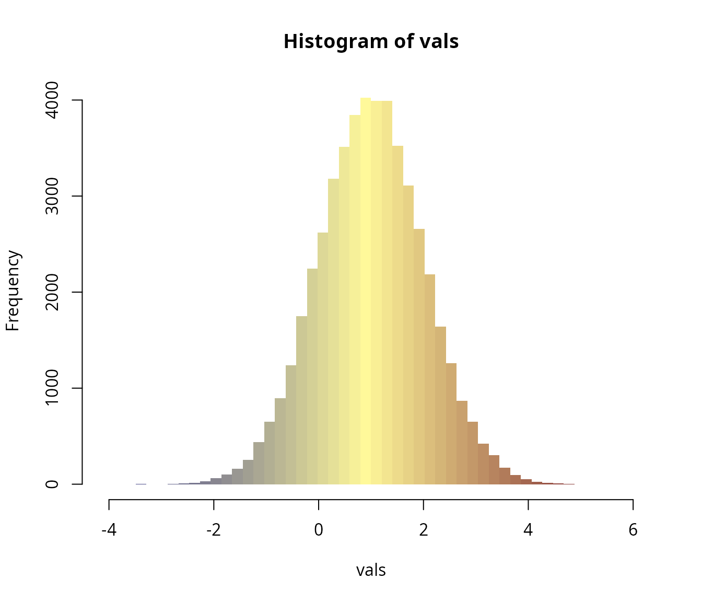
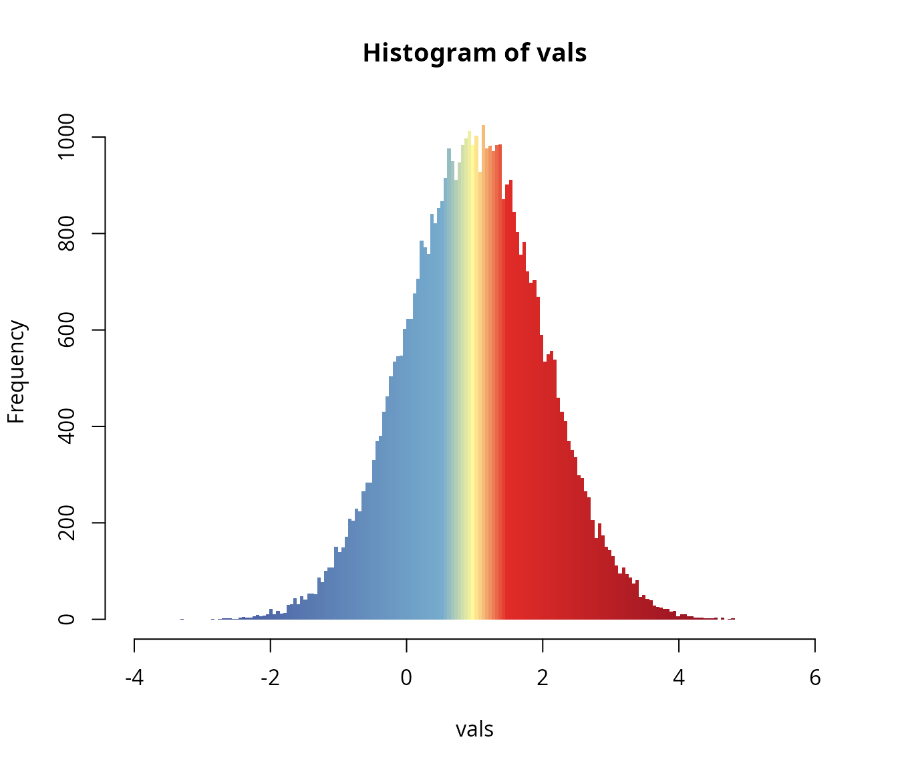
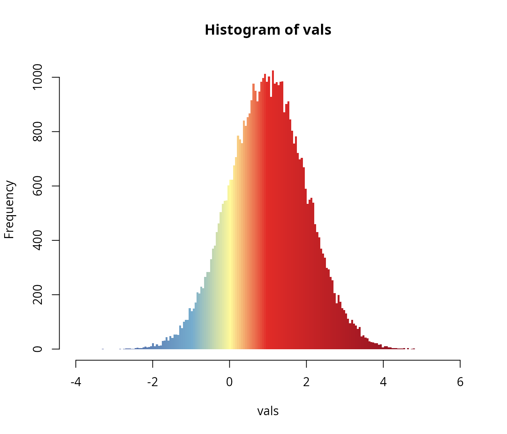

# Histogram examples

The purpose of this utility package is to give full access to the
customization and calibration of color ramps in the R environment. The
resulting objects can be instantly passed to various plotting methods,
such those provided by `sf`, `terra` and `fields` to mention a few. See
some examples below and on the package’s website:
<https://adamtkocsis.com/rampage/>.

``` r
library(rampage)
```

The package itself relies on
[`grDevices::colorRampPalette`](https://rdrr.io/r/grDevices/colorRamp.html)
function, which is used to linearly interpolate between colors that are
tied to specific values.

The basic functionality of the package can be combined with any colors,
either custom-selected or coming from a color ramp function. To provide
an example, `rampage` includes a simple 5-color ramp called `gradinv`:

``` r
gradinv
#> function (n) 
#> {
#>     x <- ramp(seq.int(0, 1, length.out = n))
#>     if (ncol(x) == 4L) 
#>         rgb(x[, 1L], x[, 2L], x[, 3L], x[, 4L], maxColorValue = 255)
#>     else rgb(x[, 1L], x[, 2L], x[, 3L], maxColorValue = 255)
#> }
#> <bytecode: 0x5e458e77b2c0>
#> <environment: 0x5e458e788830>
```

## Histograms

For the sake of a minimal demonstration, `rampage` can be used to
colorize bars of a histogram depending on their domain (breakpoints). We
can illustrate this with sample from a Gaussian distribution:

``` r
set.seed(1)
vals<- rnorm(50000,1,1)
```

### Color tiepoint data frame

The definition of color ramps depend on the given colors (`"color"`) and
the the values they are tied to. In the simplest case, we can use

``` r
df <- data.frame(
  z=c(-4, 1,  6),
  color=gradinv(3)
)
df
#>    z   color
#> 1 -4 #33358A
#> 2  1 #FFF99A
#> 3  6 #690720
```

Using the default `z` and `color` arguments:

``` r
ex <- expand(df, n=50)
```

This `hist` function can be used with a set of breakpoints (`breaks`)
that are used to define the bars. The color of the individual bars is
vectorized, if exactly as many colors as many bars are provided (number
of breaks minus one), then the bars will be colored accordingly.

``` r
hist(vals, breaks=ex$breaks, col=ex$col, border=NA)
```



### More breaks

The number of levels (breakpoints -1) is directly controled by `n`. A
finer resolution can be achieved with

``` r
exMore <- expand(df, n=100)
```

``` r
hist(vals, breaks=exMore$breaks, col=exMore$col, border=NA)
```


### More tiepoints

Specifying more tiepoints in the `data.frame` will give more control
over the exact placement of the colors. For example if we want to
clearly separate the values around 1 (population mean), then we can tie
more colors to values that just above and below the values

``` r
dfMoreTies <- data.frame(
  z=c(-4, 0.5, 1,  1.5, 6),
  color=gradinv(5)
)
dfMoreTies
#>      z   color
#> 1 -4.0 #33358A
#> 2  0.5 #76ACCE
#> 3  1.0 #FFF99A
#> 4  1.5 #E22C28
#> 5  6.0 #690720
```

This can then be expanded to a full color ramp:

``` r
exMoreTies <- rampage::expand(dfMoreTies, n=200)
```

Which can be visualized with the `hist` function.

``` r
hist(vals, breaks=exMoreTies$breaks, col=exMoreTies$col, border=NA)
```



The exact placement of the colors are easily customizable by tweaking
the `z` values in the `data.frame` that is expanded into the ramp. For
instance, if we want the colorings to reflect the values (e.g. 0 is more
important than the mean):

``` r
dfSkewed <- data.frame(
  z=c(-4, -1, 0,  1, 6),
  color=gradinv(5)
)
dfSkewed
#>    z   color
#> 1 -4 #33358A
#> 2 -1 #76ACCE
#> 3  0 #FFF99A
#> 4  1 #E22C28
#> 5  6 #690720
```

Expanding to a full color ramp:

``` r
exSkewed <- rampage::expand(dfSkewed, n=200)
```

``` r
hist(vals, breaks=exSkewed$breaks, col=exSkewed$col, border=NA)
```



See the package website for package-specific examples.
