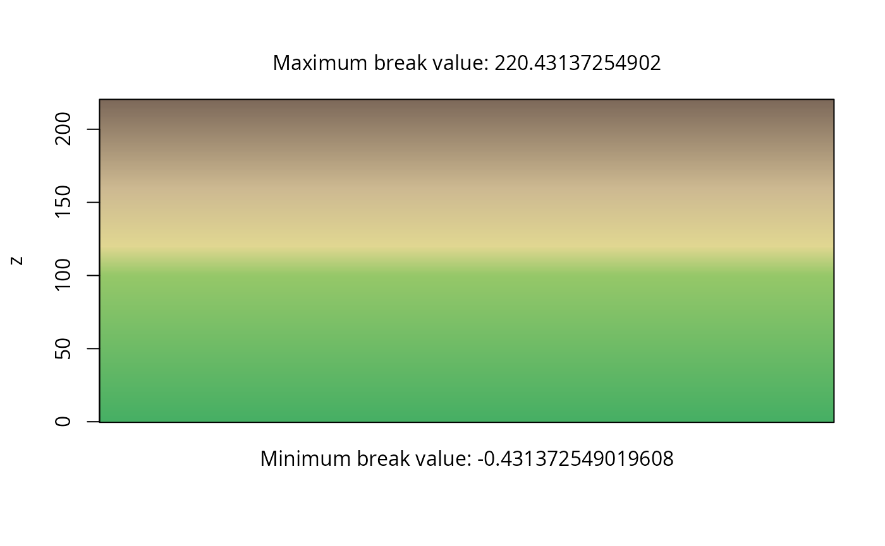
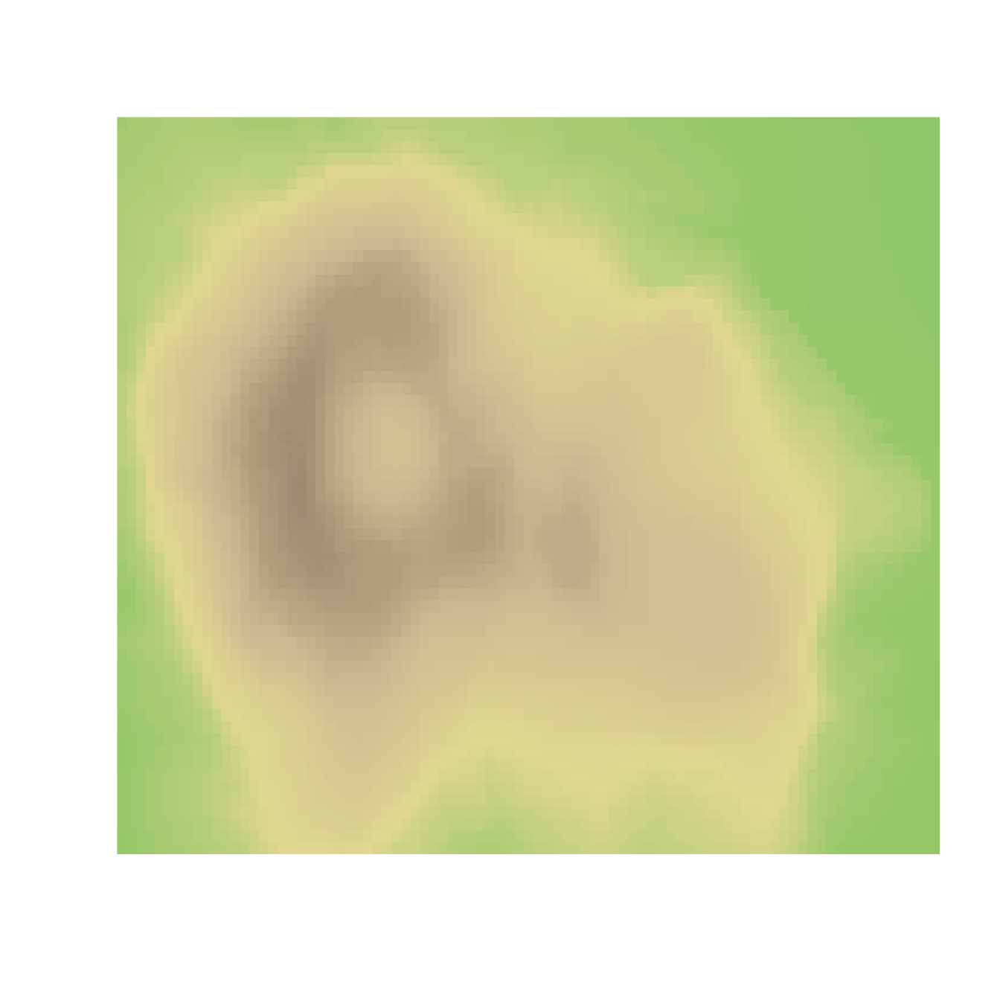
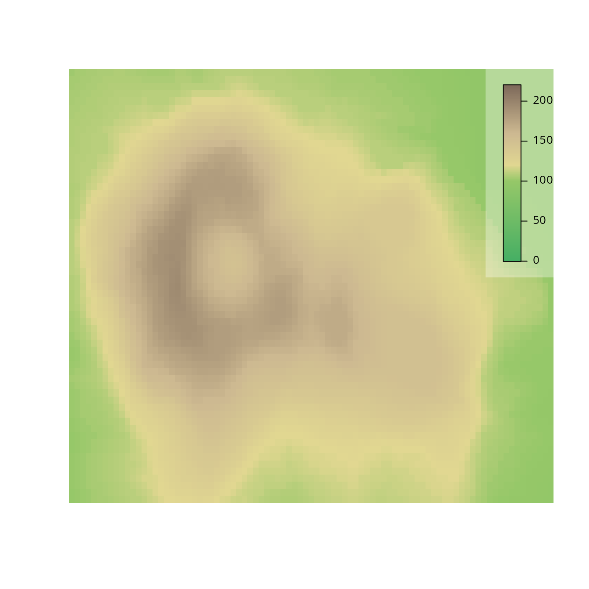
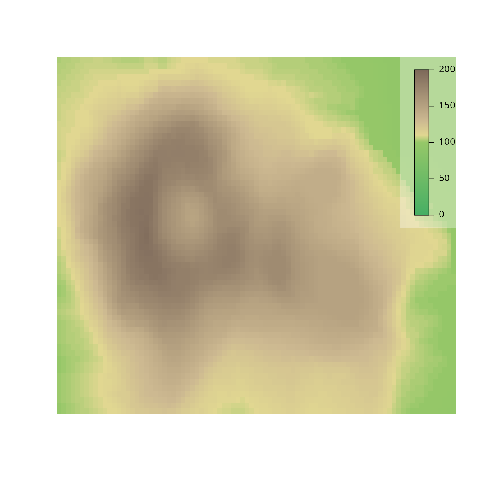
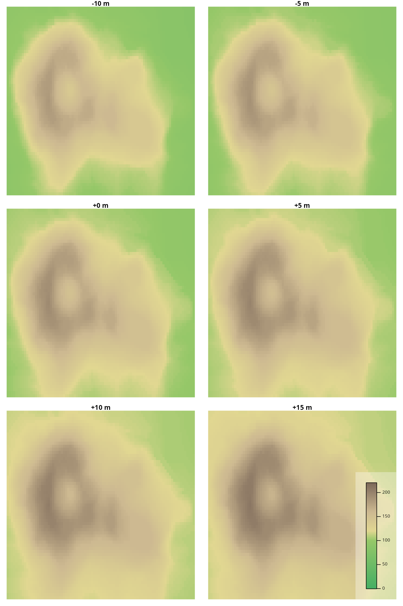
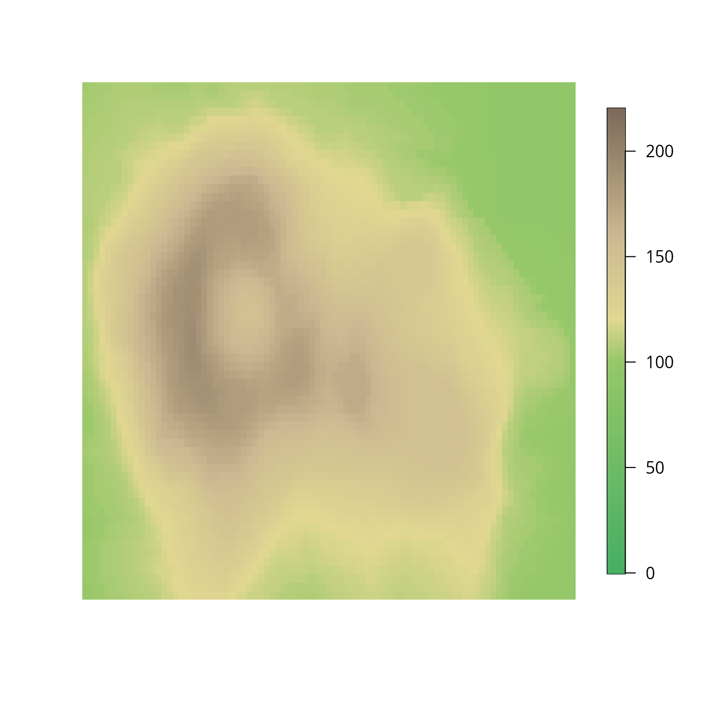
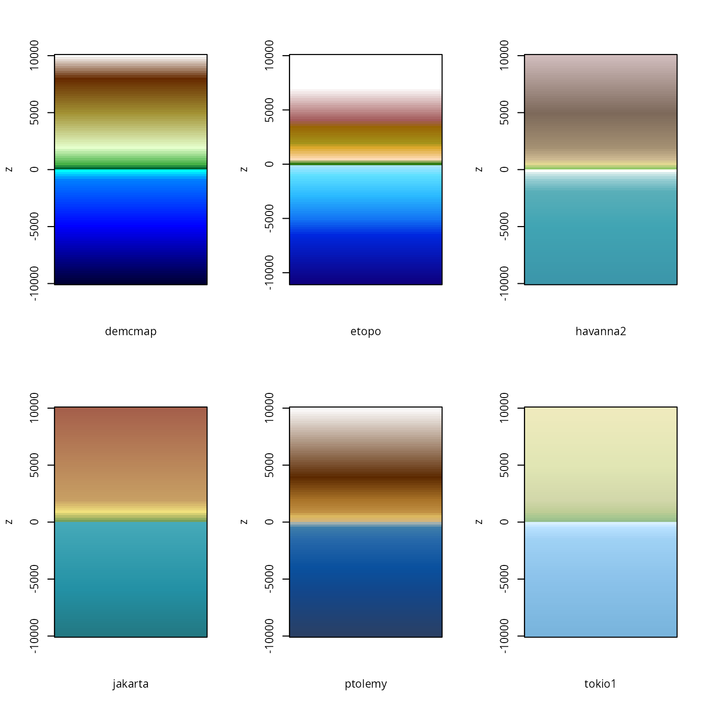
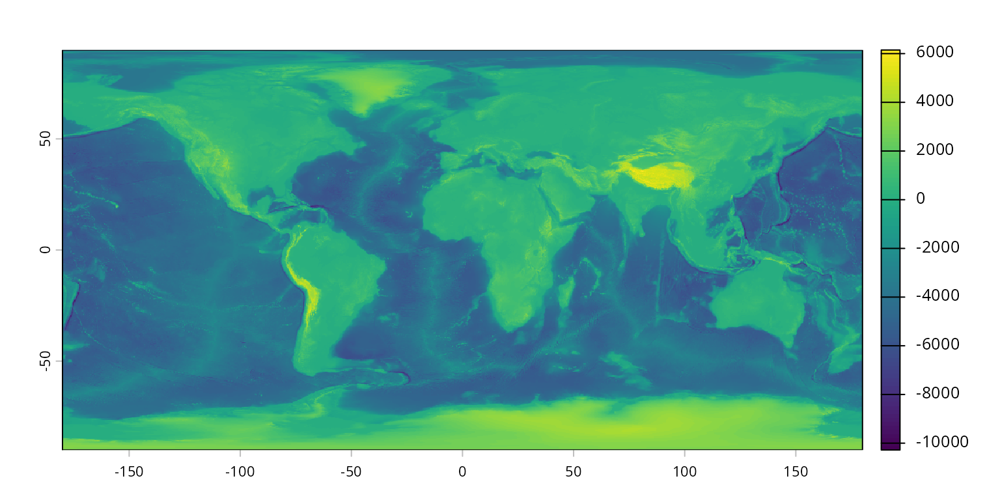
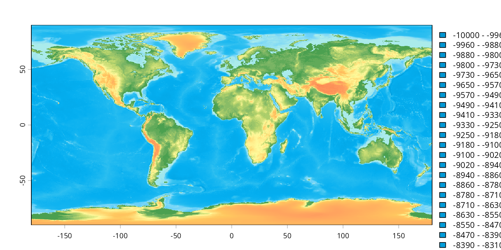
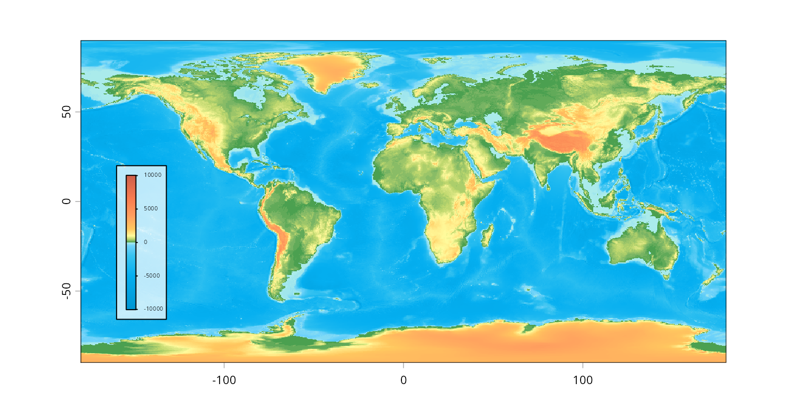

# 2. Topographic maps

## 1. Topography matrices

The built-in `volcano` topographic data.

``` r
data(volcano)
```

Attach the package.

### Create a color ramp

``` r
library(rampage)
```

Specify tiepoints for the color ramp calibration.

``` r
tiepoints <- data.frame(
    z = c(0, 100, 120, 160,220), 
    color = c("#46AF64", "#96C869", "#E1D791", "#CDB991", "#7D695A")
)
```

Construct an actual color ramp from the tiepoints:

``` r
# expand
ramp <- expand(tiepoints, n=256) 
str(ramp)
#> List of 3
#>  $ col   : chr [1:256] "#46AF64" "#46AF64" "#47AF64" "#48AF64" ...
#>  $ breaks: num [1:257] -0.431 0.431 1.294 2.157 3.02 ...
#>  $ mid   : num [1:256] 0 0.863 1.725 2.588 3.451 ...
#>  - attr(*, "class")= chr "calibramp"
```

Visualize the color ramp.

``` r
plot(ramp)
```



### Plotting with `image`

Use the color ramp to plot the data.

``` r
image(volcano, breaks=ramp$breaks, col=ramp$col, axes=FALSE)
```



Use the `ramplegend` function to draw a legend:

``` r
image(volcano, breaks=ramp$breaks, col=ramp$col, axes=FALSE)
ramplegend("topright", ramp=ramp, cex=0.7, box=list(border=NA, col="#ffffff55"))
```



### Different shading

``` r
tiepoints2 <- data.frame(
    z = c(0, 100, 110, 130,200), 
    color = c("#46AF64", "#96C869", "#E1D791", "#CDB991", "#7D695A")
)
ramp2 <- expand(tiepoints2, n=512) 
```

The same topography, same palette, with different tiepoints:

``` r
image(volcano, breaks=ramp2$breaks, col=ramp2$col, axes=FALSE)
ramplegend("topright", ramp=ramp2, cex=0.7, box=list(border=NA, col="#ffffff55"))
```



### Changes

A hypothetical succession assuming a 5 meter increase:

``` r
par(mfrow=c(3,2), mar=c(1,1,1,1))
image(volcano-10, breaks=ramp$breaks, col=ramp$col, axes=FALSE, main="-10 m")
image(volcano-5, breaks=ramp$breaks, col=ramp$col, axes=FALSE, main="-5 m")
image(volcano, breaks=ramp$breaks, col=ramp$col, axes=FALSE, main="+0 m")
image(volcano+5, breaks=ramp$breaks, col=ramp$col, axes=FALSE, main="+5 m")
image(volcano+10, breaks=ramp$breaks, col=ramp$col, axes=FALSE, main="+10 m")
image(volcano+15, breaks=ramp$breaks, col=ramp$col, axes=FALSE, main="+15 m")
ramplegend("bottomright", ramp=ramp, cex=0.7, box=list(border=NA, col="#ffffff55"))
```



### With `imagePlot`

A similar effect can be reached using the `imagePlot` function from
`fields` extension package, which will display the legend for color ramp
automatically.

``` r
library(fields)
#> Loading required package: spam
#> Spam version 2.11-4 (2026-05-28) is loaded.
#> Type 'help( Spam)' or 'demo( spam)' for a short introduction 
#> and overview of this package.
#> Help for individual functions is also obtained by adding the
#> suffix '.spam' to the function name, e.g. 'help( chol.spam)'.
#> 
#> Attaching package: 'spam'
#> The following objects are masked from 'package:base':
#> 
#>     backsolve, forwardsolve
#> Loading required package: viridisLite
#> Loading required package: RColorBrewer
#> 
#> Try help(fields) to get started.

# the function call
imagePlot(volcano, breaks=ramp$breaks, col=ramp$col, axes=FALSE)
```



## 2. Georeferenced raster topography

### Built-in objects for topographies

The rampage package includes a built-in set of topogoraphic color
schemes (`topos`). These can be accessed with the `data` function.

``` r
data(topos)
```

This object is a `list` of `data.frames` that are potential inputs to
the `expand` function. For instance, if you want to generate 256 colors
from the `'zagreb'` theme, you can do that with

``` r
topoRamp <- expand(topos$zagreb, n=256)
```

This ramp can be visualized with the `rampplot` function:

``` r
rampplot(topoRamp)
```


This shows the exact values that are rendered to the specific interals
of height.

Here are the currently accessible ramps:

``` r
par(mfrow=c(2,3))
for(i in 1:length(topos)){
        # the current color map
        current<- expand(topos[[i]], n=100)
        rampplot(current, xlab=names(topos[i]), breaklabs=FALSE)
}
```



### Topographies with `terra`

The `terra` extension is an ideal tool to visualize georeference
topographic data, such as the
[ETOPO](https://www.ncei.noaa.gov/products/etopo-global-relief-model)
global topographic relief model. To provide an example, a downscaled
0.1x0.1 degree-resolution version of this ETOPO1 version of this model
is deposited on the [package’s
website](http://adamtkocsis.com/rampage/ETOPO1_ice_c_20110606_tiff_1.tif),
which you can read in with the following line of code:

``` r
library(terra)
#> terra 1.9.27
#> 
#> Attaching package: 'terra'
#> The following object is masked from 'package:fields':
#> 
#>     describe
# download the file
tmp <- paste0(tempdir(), "etopo1.nc")
download.file("https://adamtkocsis.com/rampage/etopo1_Ice_c_gdal_0.1.nc", tmp)

# and read it in
etopo <- rast(tmp)
etopo
#> class       : SpatRaster
#> size        : 1800, 3600, 1  (nrow, ncol, nlyr)
#> dimensions  : longitude, latitude (3600, 1800}
#> resolution  : 0.1, 0.1  (x, y)
#> extent      : -180, 180, -90, 90  (xmin, xmax, ymin, ymax)
#> coord. ref. : lon/lat WGS 84
#> source      : RtmpFObIyUetopo1.nc
#> varname     : etopo1_Ice_c_gdal_0.1
#> name        : etopo1_Ice_c_gdal_0.1
```

This can be visualized with the default viridis palette using the plot
function:

``` r
plot(etopo)
```



We can get this to work with the our topographic ramp, by referring to
the `col` abd `breaks` arguments of the plot, as we did before.

``` r
plot(etopo, col=topoRamp$col, breaks=topoRamp$breaks)
```



Note that by default this will use a categorical legend, which is not
ideal. Setting `type="continuous"` will reposition the color values,
making it difficult to assert the correctness of the legend-to-values
relationship. If a legend is desired, it can be plotted with the
`ramplegend` function:

``` r
plot(etopo, col=topoRamp$col, breaks=topoRamp$breaks, legend=FALSE)
ramplegend(col=topoRamp$col,breaks=topoRamp$breaks, cex=0.3, x=-160, y=20)
```



Which leaves a much better visual impression.
