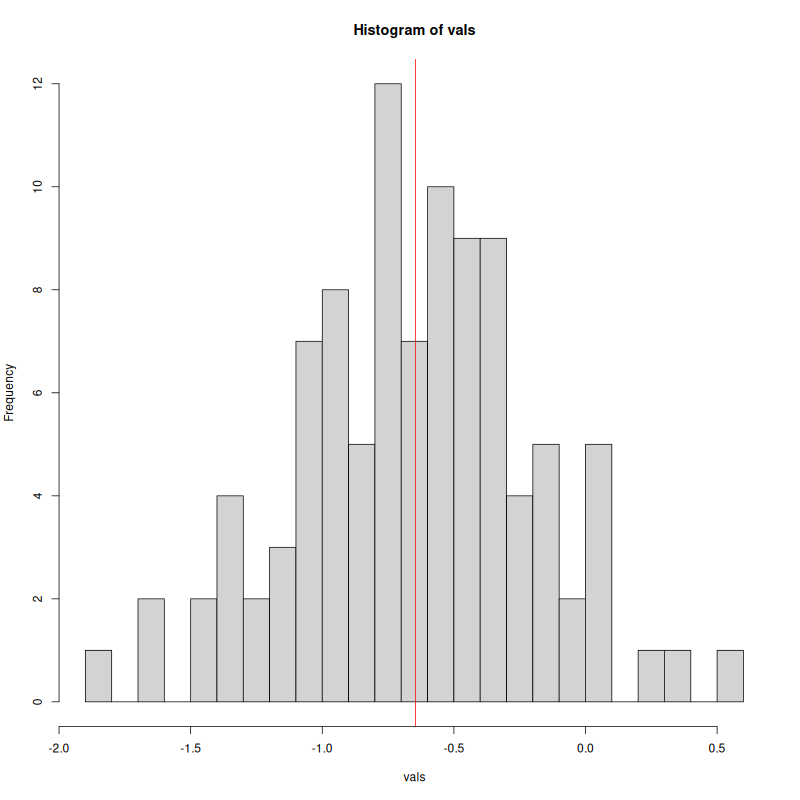

```{r setup, include=FALSE}
knitr::opts_chunk$set(echo = TRUE)

library(badger)
```

# rampage

`r badge_devel("adamkocsis/rampage", "green")`
`r badge_cran_release("rampage", "blue")`
`r badge_cran_download("rampage", "grand-total", "yellow")`
`r badger::badge_doi(doi = "10.5281/zenodo.10546420.", color = "blue")` 

## Stretchable Color Ramps 

Raaampaaage! This package was written out of sheer anger. Many visulization tasks involve plotting heatmaps, where colors represent numeric values. There is a high number of extensions that have pre-defined components to make such representations with color palettes, but having precise control over the exact relationship between colors and values seems to be a constant technical nuissance. The `rampage` extension aims to make this control easier and allow users to construct and use color ramps based on explicit relationships between colors and values.  

## Example case / Rationale

THe visual message of a heatmap-figure is highly influenced by the dominance of specific colors in the heatmap. For instance, let's consider these example data that come form a slightly shifted (non-zero mean) Gaussian distribution:

```{r, echo=TRUE, eval=FALSE}
library(rampage)

set.seed(1)
# random values in a matrix
vals<- matrix(rnorm(100, mean=-0.7, sd=0.5), ncol=10)

# the histogram of the values
hist(vals, breaks=20)
abline(v=mean(vals), col="red")
```

```{r, echo=FALSE, eval=TRUE, results=FALSE}
library(rampage)

set.seed(1)
# random values in a matrix
vals<- matrix(rnorm(100, mean=-0.7, sd=0.5), ncol=10)

png("man/figures/hist.png", width=800,height=800)
	# the histogram of the values
	hist(vals, breaks=20)
	abline(v=mean(vals), col="red")
dev.off()
```




This small set of data is wrapped in a matrix to give the values some positional context, similar to spatial data. When these data are visualized, the automatic ramping will use the range of values provided for the plotting function: for instance, the default plotting with the `fields` package:

```{r, echo=TRUE, eval=FALSE}
library(fields)
imagePlot(vals, col=rev(gradinv(100)))
```

```{r, echo=FALSE, eval=TRUE}
png("man/figures/fields_default.png", width=800,height=800)
	library(fields)
	imagePlot(vals, col=rev(gradinv(100)))
dev.off()
```


Assuming that the values represent changes from a previous state, it might be important to highlight the `0` level, clearly separating increases (positive) from decreases (negative values), for which we can use the yellow color in this example. This task can be solved by defining a calbirated color ramp, that can be constructed with some value (`z`) to color (`color`) tiepoints in a `data.frame`:

```{r, echo=TRUE, eval=TRUE}
df <- data.frame(
  z=c(-2, -0.5, 0, 0.5, 2),
  color=rev(gradinv(5))
)
df
```

This `data.frame` can than be expanded to a full, calibrated color ramp with the `expand` function. The resulting object can be used to control `fields::imagePlot` via its `breaks` argument:

```{r, echo=TRUE, eval=FALSE}
# calibrated color ramp
ramp <- expand(df, n=100) # check: str(ramp)

# The modified color ramp 
imagePlot(vals, breaks=ramp$breaks, col=ramp$col)
```


```{r, echo=FALSE, eval=TRUE, results=FALSE}
# calibrated color ramp
ramp <- expand(df, n=100)

png("man/figures/fields_ramped.png", width=800,height=800)
	# the actual plot
	imagePlot(vals, breaks=ramp$breaks, col=ramp$col)
dev.off()
```


## Connecting to additional R extension

Using `fields` is just a single example, as many R packages rely on a similar `breaks` and `col` argument pair the explicit control of heatmap levels. These include (to mention a few), the `terra` and `sf` spatial packages. 

