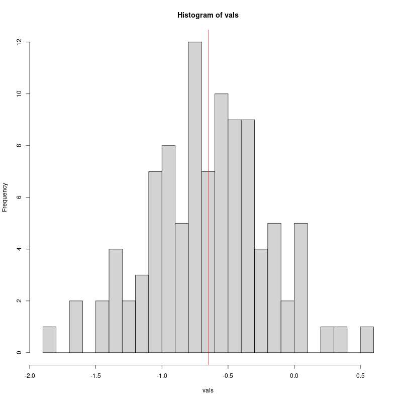
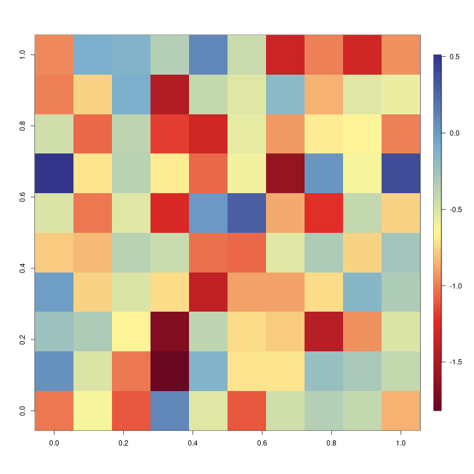
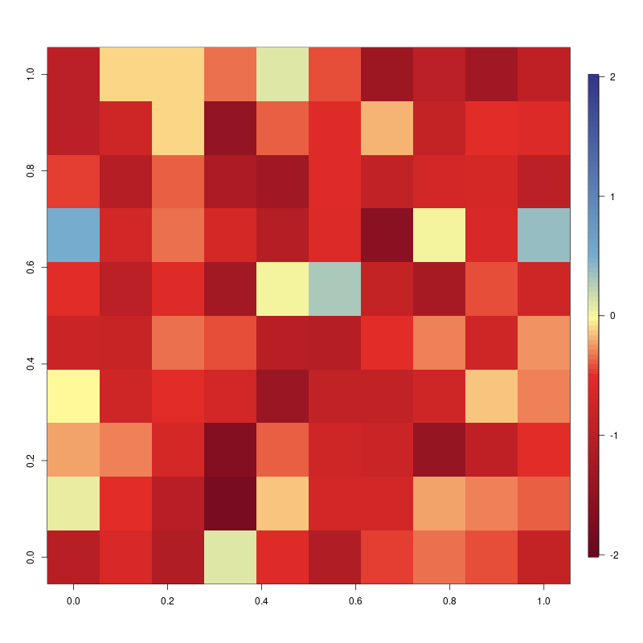

# rampage

[](https://github.com/adamkocsis/rampage)
[](https://cran.r-project.org/package=rampage)
[](https://cran.r-project.org/package=rampage)
[](https://doi.org/10.5281/zenodo.10546420.)

## Stretchable Color Ramps

Raaampaaage! This package was written out of sheer anger. Many
visulization tasks involve plotting heatmaps, where colors represent
numeric values. There is a high number of extensions that have
pre-defined components to make such representations with color palettes,
but having precise control over the exact relationship between colors
and values seems to be a constant technical nuissance. The `rampage`
extension aims to make this control easier and allow users to construct
and use color ramps based on explicit relationships between colors and
values.

## Example case

The rationale of the package THe visual message of the image is highly
influenced by the dominance of specific colors on a heatmap.

``` r
library(rampage)

set.seed(1)
# random values in a matrix
vals<- matrix(rnorm(100, mean=-0.7, sd=0.5), ncol=10)

# the histogram of the values
hist(vals, breaks=20)
abline(v=mean(vals), col="red")
```



Automatic ramping will use the range of values provided for the plotting
function, for instance, the default plotting with the `fields` package:

``` r
library(fields)
imagePlot(vals, col=rev(gradinv(100)))
```

    ## png 
    ##   2



Assuming that the values represent changes from a previous state (or for
other reasons), it might be important to highlight the `0` level,
clearly separating increases (positive) from decreases (negative
values), for instance with the yellow color in this example. This task
can be solved by defining a color ramp:

``` r
df <- data.frame(
  z=c(-2, -0.5, 0, 0.5, 2),
  color=rev(gradinv(5))
)
df
```

That can be expanded to a full, calibrated color ramp with the `expand`
function. The resultsing object can be used to control
`fields::imagePlot` via its `breaks` argument:

``` r
# calibrated color ramp
ramp <- expand(df, n=100)

# the actual plot
imagePlot(vals, breaks=ramp$breaks, col=ramp$col)
```


